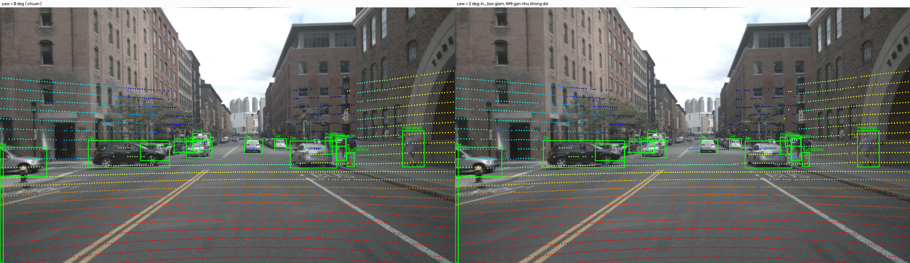
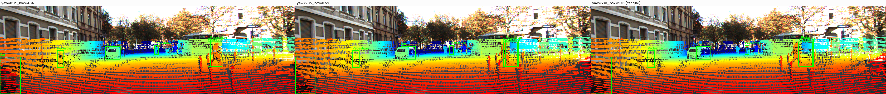
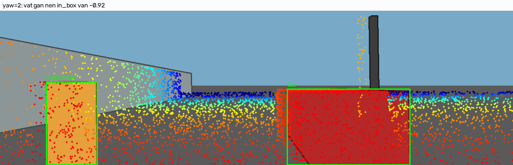

# Báo cáo Day 6: Kiểm định chất lượng căn chỉnh chiếu LiDAR–Camera (Projection QA)

- **Họ tên:** Nguyễn Văn Thân
- **MSSV:** 2A202602859 
- **Lớp:** K20
- **Link repo:** https://github.com/meth04/NguyenVanThan-2A202602859-Track4-Day21
- **Topic:** A LiDAR Camera Projection QA 
- **Dataset:** data/synthetic, data/kitti_mini, data/nuscenes_mini_subset
- **Các frame đã dùng:** 000000 (synthetic), 000011 và 000049 (KITTI 3D Object), scene-0103_010 (nuScenes v1.0-mini)

> Phương pháp: mô phỏng extrinsic bằng phép biến đổi `perturb_extrinsic` (yaw/pitch/roll theo độ, dịch chuyển theo cm), sau đó đo mức suy giảm chất lượng chiếu qua ba họ chỉ số: hình học (`fov_ratio`), có nhãn (`in_box_ratio`) và không nhãn (`nmi_intensity` thông tin tương hỗ chuẩn hoá giữa cường độ LiDAR và độ sáng ảnh xám).

## 1. Claim

Lệch yaw chỉ 0.25–0.5° giữa LiDAR và camera đã làm chỉ số căn chỉnh không nhãn (NMI giữa cường độ LiDAR và độ sáng ảnh xám) giảm tương đối 5.9–12.8% so với mức chuẩn trên cả bộ synthetic lẫn KITTI, đủ để phát hiện mất căn chỉnh mà không cần nhãn 3D; trong khi `fov_ratio` gần như bất biến (biến thiên tối đa ~2.2% trên toàn dải 0–3°, và chỉ ~0.8% trên các frame KITTI/nuScenes) nên không phù hợp làm tiêu chí phát hiện drift. Nói cách khác, một ngưỡng phát hiện dựa trên NMI (~5% suy giảm tương đối) là khả thi và rẻ, còn `fov_ratio` là chỉ số yếu.

## 2. Evidence

### 2.1. Quét lệch yaw (nguồn: `results/yaw_perturb_sweep.csv`)

| Cấu hình / mức perturb | NMI (không nhãn) | in_box_ratio (có nhãn) | fov_ratio | Ghi chú |
|---|---|---|---|---|
| synthetic 000000, yaw 0° | 0.3182 | 0.9428 | 0.1632 | mức chuẩn |
| synthetic 000000, yaw 3° | 0.1500 | 0.9298 | 0.1668 | NMI −52.9%; in_box chỉ −1.4% |
| KITTI 000011, yaw 0° | 0.0350 | 0.8428 | 0.1847 | mức chuẩn; far bucket = 1.000 |
| KITTI 000011, yaw 1° | 0.0238 | 0.6823 | 0.1847 | far bucket 1.000 → 0.375 |
| KITTI 000049, yaw 0° | 0.0212 | 0.9771 | 0.1591 | mức chuẩn |
| KITTI 000049, yaw 3° | 0.0228 | 0.9423 | 0.1604 | in_box −3.6% |
| nuScenes scene-0103_010, yaw 0° | 0.0750 | 0.8750 | 0.0899 | near bucket = 0.000 (xem §3) |
| nuScenes scene-0103_010, yaw 3° | 0.0725 | 0.7000 | 0.0902 | NMI chỉ −3.4% → **không** đạt ngưỡng |

Ngưỡng phát hiện tự động với mức suy giảm tương đối 5% (nguồn: `results/detection_threshold.csv`):

| Frame | NMI chuẩn | Yaw phát hiện | Suy giảm tương đối | Kết luận |
|---|---|---|---|---|
| synthetic 000000 | 0.3182 | **0.50°** | 11.2% | Phát hiện được |
| KITTI 000011 | 0.0350 | **0.25°** | 12.8% | Phát hiện được |
| KITTI 000049 | 0.0212 | **0.50°** | 5.9% | Phát hiện được |
| nuScenes scene-0103_010 | 0.0750 | — | — | **Bỏ sót** (NMI không giảm quá 5%) |

### 2.2. So sánh lệch xoay với lệch dịch chuyển (bonus B1; `results/translation_perturb_sweep.csv`)

Dịch chuyển tới **10 cm** hầu như không làm thay đổi `in_box_ratio`: synthetic 0.9428 → 0.9253, KITTI 000011 0.8428 → 0.8409, KITTI 000049 0.9771 → 0.9749, nuScenes 0.8750 → 0.8775. Kết luận: trong dải khảo sát, **lệch xoay gây mất căn chỉnh lớn hơn nhiều lần so với lệch tịnh tiến** — ưu tiên hiệu chỉnh góc khi căn chỉnh.

### 2.3. Độ nhạy theo khoảng cách vật thể (yaw 0° → 1°; `results/object_distance_detail.csv`)

| Vật thể (frame) | Khoảng cách | in_box 0° → 1° | Nhận xét |
|---|---|---|---|
| KITTI 000011, Pedestrian (obj 3) | 34.0 m (far) | 1.000 → 0.375 | vật xa suy giảm mạnh nhất |
| KITTI 000049, Pedestrian (obj 10) | 32.3 m (far) | 0.881 → 0.636 | cùng xu hướng |
| KITTI 000049, Pedestrian (obj 6) | 4.63 m (near) | 0.831 → 0.738 | gần nhưng vẫn giảm |
| synthetic 000000, Car (obj 0) | 7.01 m (near) | 0.980 → 0.952 | gần, suy giảm nhẹ |

Vật thể ở bucket `far_gt30m` là chỉ báo nhạy nhất cho mất căn chỉnh, do một lệch góc nhỏ tạo sai số vị trí ảnh lớn theo tỉ lệ khoảng cách.

### 2.4. Độ trễ (bonus B3; `results/latency_benchmark.csv`, 30 lần lặp, bỏ 3 lần làm nóng)

| Frame | Số điểm | p50 (ms) | p95 (ms) | mean (ms) |
|---|---|---|---|---|
| synthetic 000000 | 23 953 | 3.99 | 4.84 | 4.03 |
| KITTI 000011 | 108 004 | 16.78 | 19.97 | 16.98 |
| KITTI 000049 | 113 691 | 18.73 | 20.51 | 18.39 |
| nuScenes scene-0103_010 | 34 720 | 5.40 | 6.00 | 5.34 |

Chi phí gần như tuyến tính theo số điểm; ngân sách thời gian thực (33 ms/frame cho 30 FPS) đạt được trên mọi frame khảo sát.

**Phần cứng đo:** CPU AMD Ryzen 5 6600HS (6 nhân, 12 luồng), không dùng GPU. Số liệu latency phụ thuộc máy nên khi chạy lại trên máy khác sẽ lệch; các chỉ số còn lại (fov_ratio, in_box_ratio, NMI) thì tái lập chính xác.


Các hình còn lại: `results/figures/yaw_sweep_metrics.png`, `results/figures/distance_sensitivity.png`, `results/figures/rotation_vs_translation.png`, `results/figures/latency_benchmark.png`; ảnh overlay cho cả bốn frame có tiền tố `demo_overlay_`.

## 3. Failure case

### 3.1. Chỉ số không nhãn bỏ sót drift trên nuScenes lớp Metric



Trên frame nuScenes `scene-0103_010`, NMI gần như không giảm khi tăng yaw (0.0750 → 0.0725 tại 3°, tức chỉ −3.4%), nên ngưỡng 5% không phát hiện được drift dù `in_box_ratio` đã giảm rõ (0.875 → 0.700). Nguyên nhân: NMI phụ thuộc phân bố cường độ LiDAR và độ sáng ảnh; với nuScenes (điểm đã deskew, camera `CAM_FRONT` có dải sáng hẹp, mật độ điểm trong khung thấp ~3 120 điểm), tín hiệu tương quan yếu hơn KITTI nhiều. 

=> chỉ số label-free cần được hiệu chỉnh/kiểm định trên từng sensor, không thể dùng một ngưỡng chung.

### 3.2. `in_box_ratio` mất tính đơn điệu trên KITTI 000011 — lớp **Metric**



Trên KITTI 000011, `in_box_mean` giảm từ 0.8428 (0°) xuống 0.5885 (2°) rồi **tăng trở lại** 0.7515 (3°). Đây là **hiện tượng giả tạo của chỉ số**, không phải hệ thống "tốt lên": khi lệch đủ lớn, các điểm bị đẩy ra khỏi khung ảnh (tử số và mẫu số của tỉ lệ đều thay đổi), đồng thời các vật thể nhỏ ở xa có thể vô tình rơi lại vào hộp nhãn 2D. **Bài học:** `in_box_ratio` chỉ đáng tin trong dải lệch nhỏ; khi dùng làm chỉ số giám sát phải giới hạn dải và báo cáo kèm số điểm còn lại.

### 3.3. Vật thể gần vẫn sai căn chỉnh ngay ở mức chuẩn — lớp **Geometry / nhãn**

Trên nuScenes, xe `Car` ở khoảng cách **6.83 m** (obj 3, 255 điểm) có `in_box_ratio = 0.000` ở **cả yaw 0° và 1°**. Vì đây là mức "chuẩn" (chưa perturb), đây là **lỗi thật của dữ liệu/hộp nhãn** (vật thể bị che một phần, hoặc hộp 3D–2D không khớp), không do thuật toán chiếu. **Bài học:** phải chẩn đoán dữ liệu **trước** khi dùng chỉ số để suy luận về căn chỉnh.

### 3.4. Bão hoà chỉ số trên bộ synthetic — lớp **Metric + Geometry**



Trên synthetic, `in_box_ratio` vẫn ở mức cao (>0.92) ngay cả ở yaw 3°, vì mọi vật thể đều ở gần (5–7 m) và hộp 2D rất lớn so với sai số chiếu. Kết quả là chỉ số **bão hoà**, khó phân biệt mức lệch nhỏ. Ở đây NMI (0.3182 → 0.1500) mới là tín hiệu hữu dụng.

## 4. Khuyến nghị nếu triển khai thật

**Use-case:** hệ thống ADAS/robot tự hành dùng LiDAR + camera cho nhận thức và hợp nhất cảm biến; đây chính là bước **kiểm tra sức khoẻ căn chỉnh (calibration health monitoring)** chạy định kỳ trên xe.

1. **Dùng hai tầng giám sát:** tầng không nhãn (NMI) chạy liên tục, rẻ, cảnh báo sớm; tầng có nhãn (`in_box_ratio` theo bucket khoảng cách) chạy khi cần xác nhận. Riêng nuScenes cho thấy tầng không nhãn phải được **hiệu chỉnh theo sensor** trước khi tin dùng.
2. **Ưu tiên hiệu chỉnh góc:** lệch dịch chuyển ≤10 cm gần như không ảnh hưởng, nên quy trình bảo trì nên tập trung vào góc (yaw/pitch/roll) và ưu tiên kiểm tra ở vùng xa (>30 m) — nơi chỉ số nhạy nhất.
3. **Ngưỡng vận hành gợi ý:** cảnh báo khi NMI giảm tương đối ≥5% (tương ứng yaw ~0.25–0.5° trên KITTI), kèm điều kiện `far bucket` giảm quá 10%.
4. **Trade-off:** ngân sách tính toán ~17–19 ms/frame cho 108k điểm (KITTI) còn nằm trong 33 ms, nhưng nếu chạy trên nền tảng nhúng cần giảm mật độ điểm (voxel downsampling) hoặc lấy mẫu khung.
5. **Bước tiếp theo:** (a) mở rộng sang pitch/roll; (b) thay NMI bằng chỉ số bất biến theo sensor (ví dụ tương hỗ thông tin trên gradient biên); (c) tự động phân tách lỗi nhãn khỏi lỗi căn chỉnh trước khi cảnh báo.

## 5. Cách chạy lại

Toàn bộ kết quả tái tạo được từ repo sạch (đã cài `requirements.txt`); pipeline không dùng phép ngẫu nhiên nào (mọi bước đều tất định) nên chạy lại cho ra đúng cùng số liệu.

```bash
# 0) Môi trường
python -m venv .venv
.venv\Scripts\activate            # Windows PowerShell/CMD (Linux/macOS: source .venv/bin/activate)
pip install -r requirements.txt

# 1) Kiểm tra dữ liệu (synthetic không có MANIFEST.json nên verify_data không kiểm được)
python tools/verify_data.py --data-root data/kitti_mini
python tools/verify_data.py --data-root data/nuscenes_mini_subset

# 2) Chạy toàn bộ thí nghiệm số liệu -> results/*.csv
python -m src.run_experiment
python -m src.run_experiment --help          # xem tuỳ chọn (--frames, --repeats, --skip-latency)

# 3) Chẩn đoán sức khoẻ point cloud (tìm lỗi cài sẵn trong synthetic)
python -m src.diagnose --data-root data/synthetic
python -m src.diagnose --data-root data/kitti_mini

# 4) Sinh biểu đồ, ảnh overlay và ảnh failure case -> results/figures/
python -m src.make_figures
python -m src.make_figures --help

# 5) Tự kiểm tra trước khi nộp
python tools/check_submission.py
```

Hai hàm TODO trong `starter/projection.py` (`velo_to_cam`, `cam_to_image`) đã được hoàn thiện; phần còn lại của bài nằm trong `src/`.

## 6. Khai báo sử dụng AI

| Công cụ | Dùng cho việc gì | Bạn đã kiểm chứng thế nào |
|---|---|---|
| Claude Code (Anthropic) | Hỗ trợ đọc yêu cầu, tìm hiểu xem nhiệm vụ cần hoàn thành, hai hàm TODO trong `starter/projection.py`, và diễn đạt báo cáo | Tự chạy lại toàn bộ pipeline (`run_experiment`, `diagnose`, `make_figures`), đối chiếu từng con số trong báo cáo với file CSV gốc trong `results/`, và tự xem lại các ảnh overlay/failure case để xác nhận chúng khớp mô tả |

Toàn bộ số liệu, hình ảnh và failure case trong báo cáo này đến từ các lần chạy thật của mã nguồn trong repo; không có dữ liệu hay kết quả nào được tạo thủ công.
